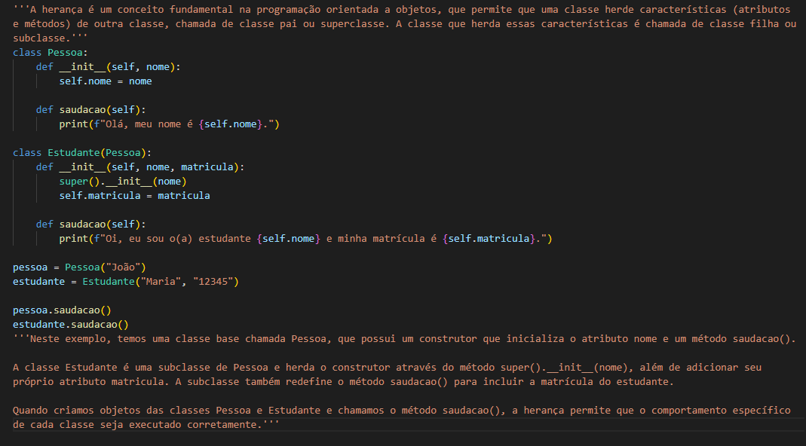
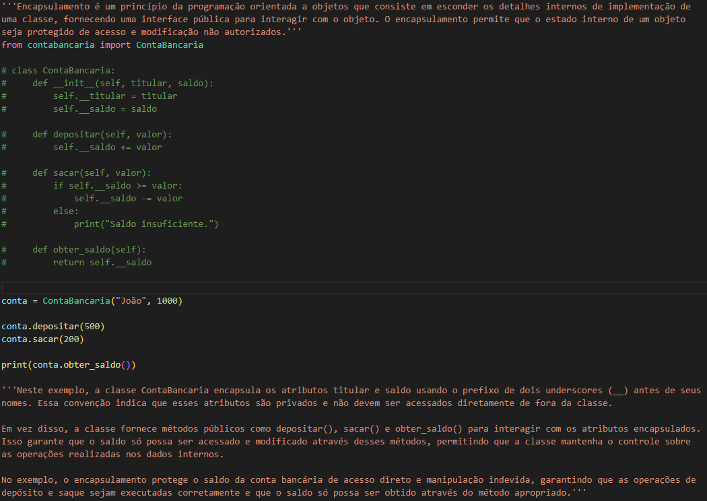

# Exemplos de Programação Orientada a Objetos em Python

Este repositório contém exemplos de código em Python que ilustram três conceitos importantes da Programação Orientada a Objetos (POO): Polimorfismo, Herança e Encapsulamento.

## Polimorfismo

O polimorfismo é a capacidade de objetos de classes diferentes serem tratados de forma uniforme por meio de uma interface comum. Isso permite que um objeto seja referenciado por um tipo mais genérico, mas ainda execute seu próprio comportamento específico. O exemplo de código `polimorfismo.py` demonstra o polimorfismo ao lidar com diferentes tipos de animais que emitem sons.

## Herança

A herança é um princípio da POO que permite que uma classe herde características (atributos e métodos) de outra classe, chamada de classe pai ou superclasse. A classe que herda essas características é chamada de classe filha ou subclasse. O exemplo de código `heranca.py` ilustra a herança ao criar uma classe "Estudante" que herda atributos e métodos de uma classe "Pessoa".

## Encapsulamento

O encapsulamento é um princípio da POO que envolve esconder os detalhes internos de implementação de uma classe, fornecendo uma interface pública para interagir com o objeto. Isso protege o estado interno do objeto de acesso e modificação não autorizados. O exemplo de código `encapsulamento.py` demonstra o encapsulamento ao criar uma classe "ContaBancaria" com atributos privados e métodos públicos para depositar, sacar e obter o saldo da conta.

---

